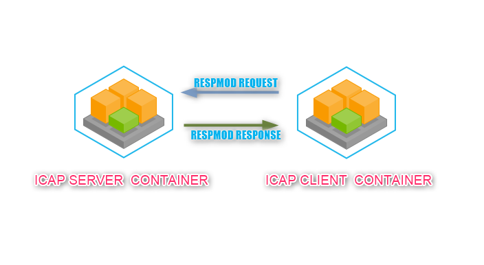

# ICAP Client2Server Test on Docker

## Creating Glasswall C-ICAP Docker Image
[Download the Source code for ICAP Server Docker](https://github.com/filetrust/c-icap)

###Build the Docker Container with named gw-icap-server.
Go to document root and run the following command

sudo docker build -t gw-icap-server:latest .

##Run the Docker with mounted Directory.
sudo docker run -d -p 1300:1344 --name gw-icap-server gw-icap-server:latest

##  Create and Run ICAP Client

###Build the Docker Container with named gw-icap.
Go to document root and run the following command
sudo docker build -t gw-icap:latest .

##Run the Docker with mounted Directory.
sudo docker run -v /home/ubuntu/tmp:/var/tmp --name gw-icap gw-icap:latest
Note: In the above command we did mount the host directory named {/home/ubuntu/tmp} to container directory named {/var/tmp}.
      The container directory [/var/tmp] is used to get the stdout on ICAP Client Dockerfile.
      Besides, we should run the docker with foreground option for get the stdout result. 

###Stop the Docker Container with named gw-icap.
sudo docker stop gw-icap

###Remove the Docker Container.
sudo docker rm --force gw-icap

###Clean & Rebuild the Docker Container.
sudo docker build --no-cache -t gw-icap:latest .

## Test

###Start the Docker Container with named gw-icap and STDOUT.
sudo docker start gw-icap | cat /home/ubuntu/tmp/log.txt

I hope my result will be usefull to test.
Thank you.
